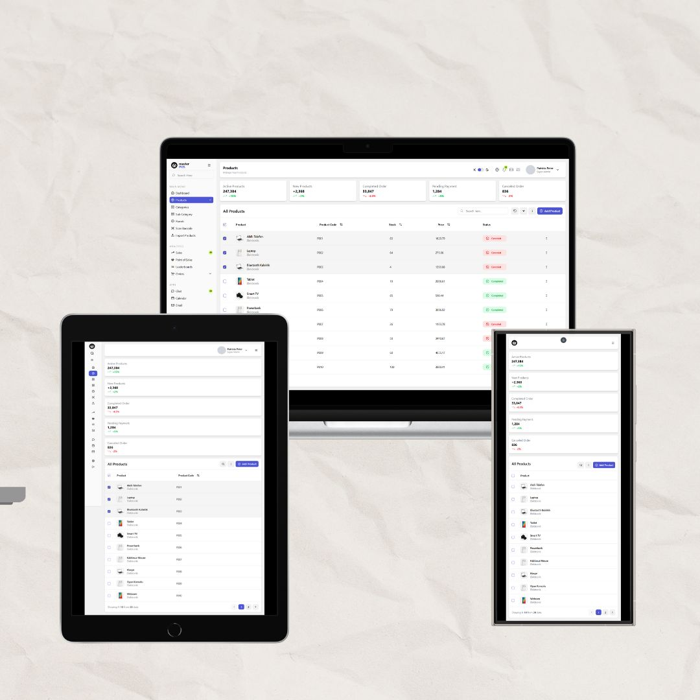

# 💼 DevCase Paneli (Next.js + Tailwind + shadcn/ui)

DevCase yönetimi için hazırlanmış modern ve responsif bir web uygulamasıdır. Next.js framework’ü ile geliştirilmiş, UI tarafında **Tailwind CSS** ve **shadcn/ui** bileşenleri kullanılmıştır. Temalar ve sidebar yönetimi için `React Context API` kullanılmıştır. Uygulama, **Lucide** ikon kütüphanesiyle sade ve modern bir görsellik sunar.

🔗 **Canlı Demo:** [www.example.com](https://www.example.com)

## 📸 Ekran Görüntüsü

Aşağıda uygulamaya ait bir ekran görüntüsü yer almaktadır:




---

## 🚀 Özellikler

- ⚡️ Next.js ile SSR (Sunucu Taraflı Render) desteği
- 🎨 Tailwind CSS ile esnek ve kolay tasarım
- 🧩 Shadcn/ui ile hazır ve özelleştirilebilir UI bileşenleri
- 🌙 Karanlık ve aydınlık tema desteği (Context API ile)
- 🧭 Sidebar navigasyonu
- 💡 Lucide ile modern ikon kullanımı
- 🌍 Vercel ile ücretsiz ve hızlı deploy

---

## 🛠️ Kullanılan Teknolojiler

| Teknoloji     | Açıklama                             |
|---------------|--------------------------------------|
| Next.js       | React tabanlı framework              |
| Tailwind CSS  | Utility-first CSS framework          |
| Shadcn/ui     | UI bileşen kütüphanesi               |
| Lucide Icons  | Hafif ve modern ikonlar              |
| Context API   | Tema ve sidebar state yönetimi       |
| Vercel        | Ücretsiz hosting ve CI/CD            |

---

## ⚙️ Kurulum ve Geliştirme

```bash
git clone https://github.com/kullanici_adi/proje-adi.git
cd proje-adi
npm install
npm run dev
